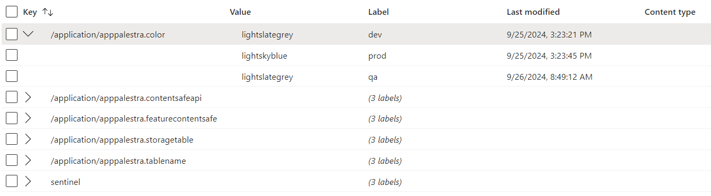
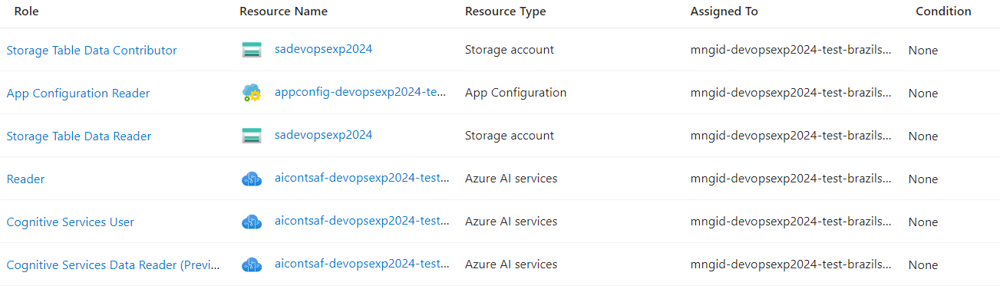

# Talk Floripa - Tech Connections Florianópolis 2024
## Habilidades que o desenvolvedor deve ter sobre Computação em Nuvem
### 09/11/2024

### Tecnologias

### Proposta

### Slides
- [Download](slides/waltercoan_techconnectionfloripa24_v1.pdf)

### Azure Services
- Storage Account
    - Duas Azure Tables PROD/DEV
- App Configuration
    
- Container Registry
- Content Safety
- Managed Identity
- Log Analytics workspaces
- Web App

### RBAC

